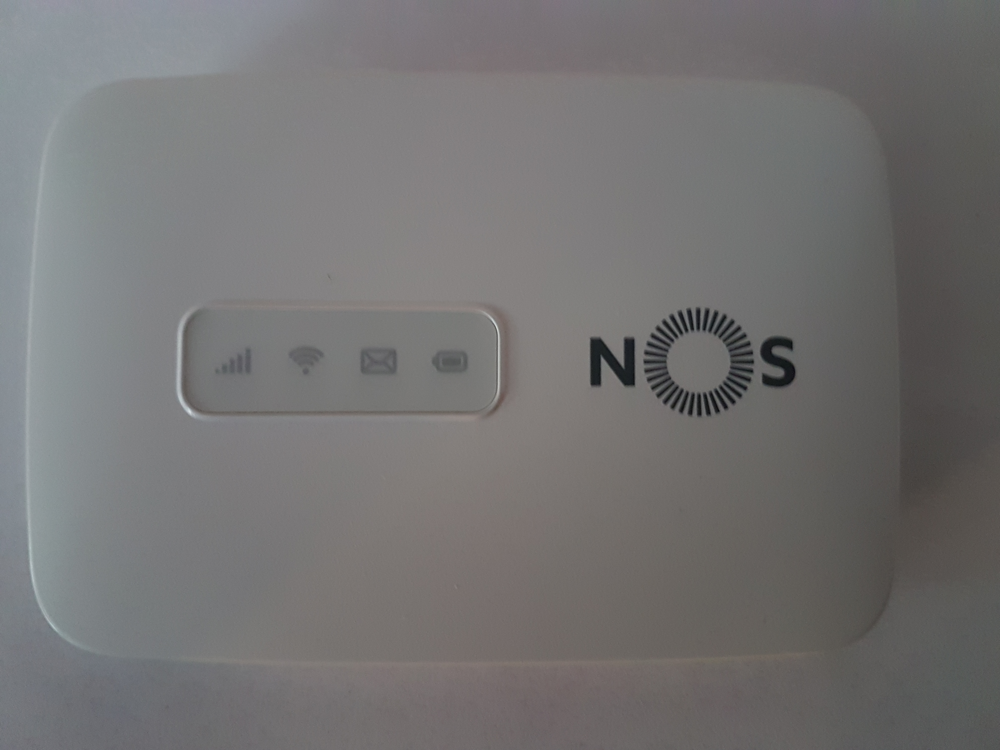

# Prometheus exporter for Alcatel modem MW40v
Prometheus exporter for Alcatel modem MW40v - tested with a NOS (http://www.nos.pt) modem

# Configuration
Configuration is done by environment variables:
* LOG_LEVEL: set log level, accepted values: Debug, Info, Warning, Error, Fatal and Panic. By default info
* MODEM_URL: modem url, by default http://192.168.1.1
* UPDATE_INTERNAL: update interval for scraping, accepted format: "1ns", "2us" (or "3µs"), "4ms", "5s", "6m", "7h". By default 10s
